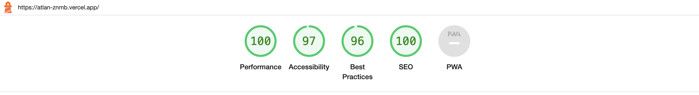

# Static Landing Page

The Acme Notes static landing page is a clean, user-friendly interface designed to showcase the app's note-taking capabilities. It features a minimalist design, highlighting key functionalities such as seamless organization, easy sharing, and secure storage. The page aims to attract users with its simplicity and efficiency, encouraging them to explore and utilize Acme Notes for their personal and professional needs.

# Page Speed and Optimisation

For all the page optimisation analysis, I have used Google's Lighthouse tool to analysze the page load time, along with how well it performs as per web standards.

<b>Page Loading time :<b>

# Frameworks + Libraries used

<b>React JS</b> - JavaScript library for building user interfaces that efficiently updates and renders components in response to data changes, enabling the development of dynamic and interactive web applications.

<b>Vite</b> - Vite is a fast and modern build tool for web development that focuses on quick development server start-up, efficient development workflows, and optimized production builds for JavaScript and TypeScript projects.

<b>Tailwind CSS</b> - Tailwind CSS is a utility-first CSS framework that provides a set of low-level utility classes, enabling rapid and flexible development of modern and responsive user interfaces.

<b>AOS</b> - The AOS library allows developers to easily add smooth, animated scroll effects to their web pages.

# Optimisations used

1. The website is hosted on Vercel, which is considered to be one of the fastest free hosting mechanisms for JavaScript based Web apps due to it's CDN and caching benefits. Additionally, it offers a free SSL for hosting, which is normally better for search engine optimization and website security.

2. Page was created with least dependencies.

3. Certain parts of the project were loaded in the background using React Lazy loading

4. Reorganized the code to reuse parts and, where needed, import as little as possible.

5. Using preconnect, that allows developers to initiate early connections to important third-party origins, improving page load performance

6. Utilizes responsive unit such as rem instead of px for responsive text where possible.

# Project Link

https://atlan-znmb.vercel.app/
